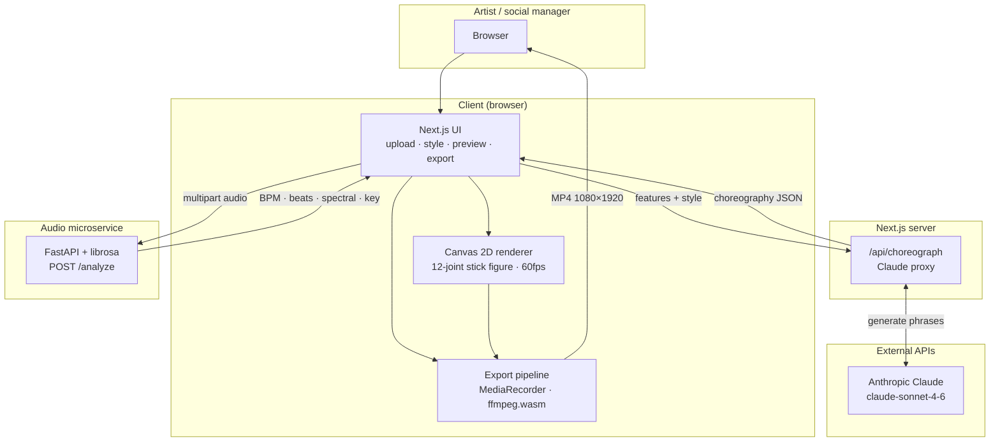
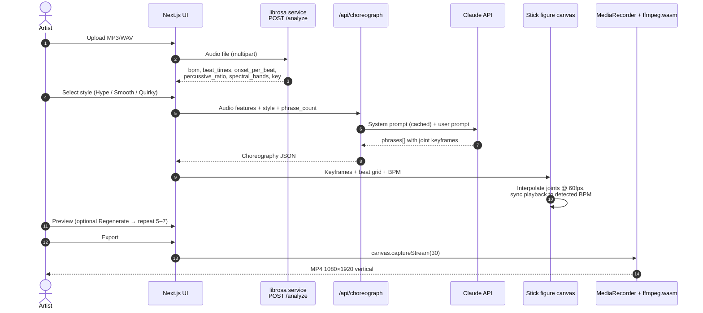
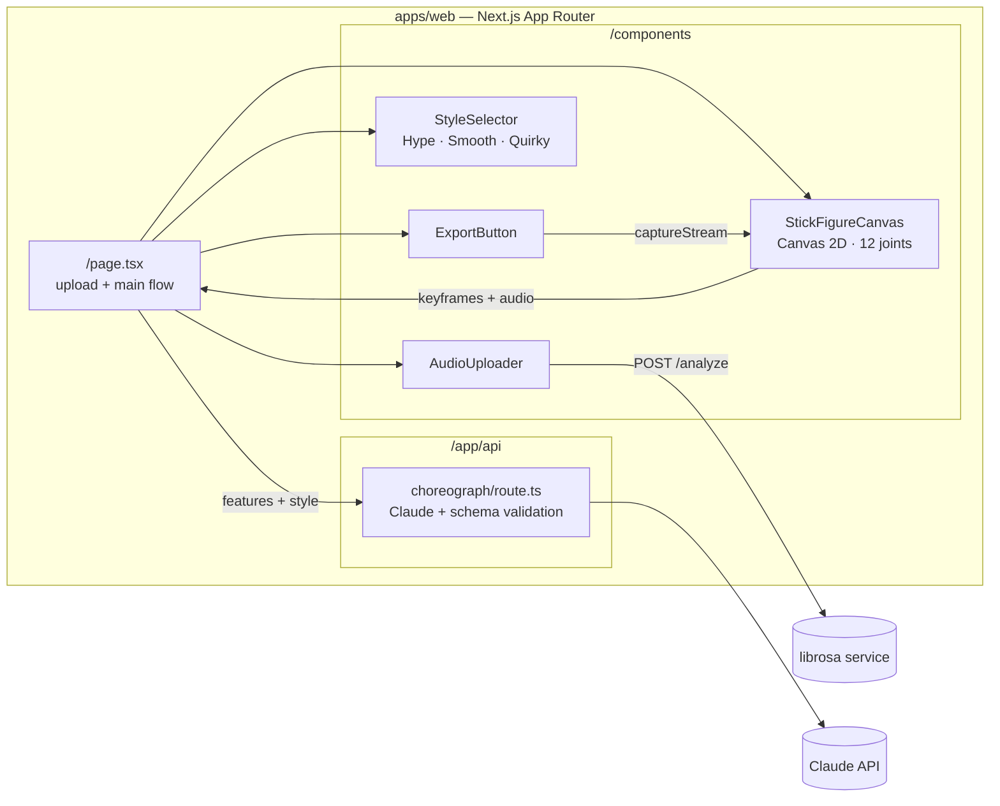
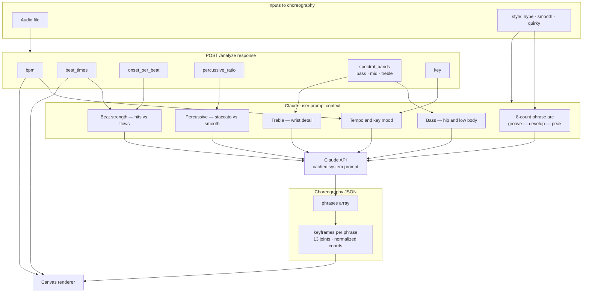
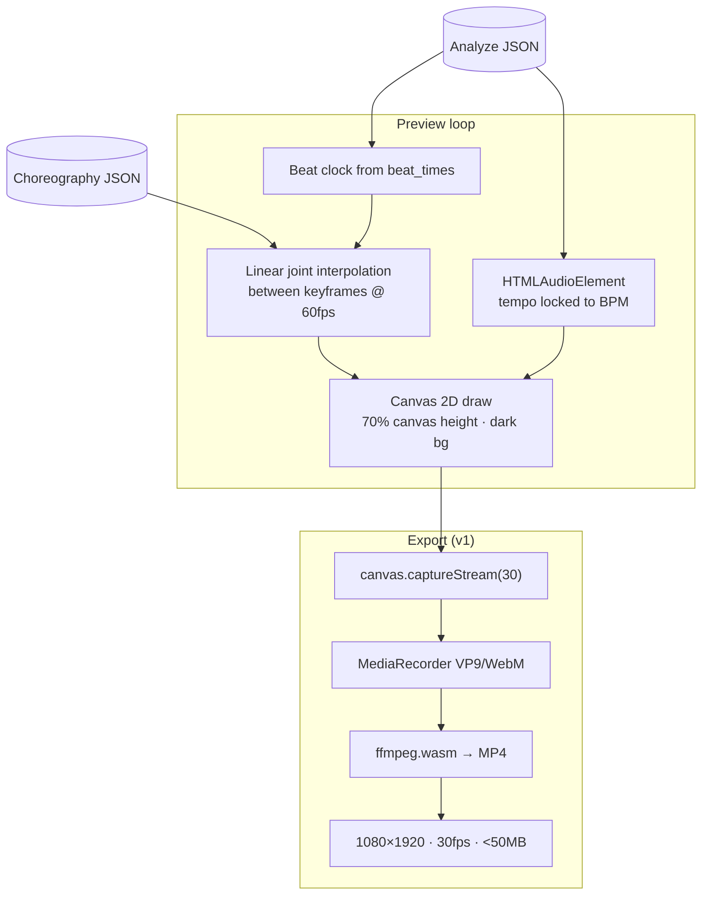
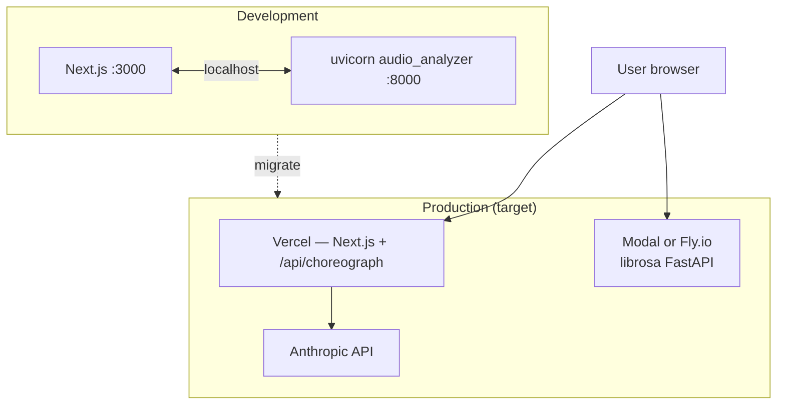
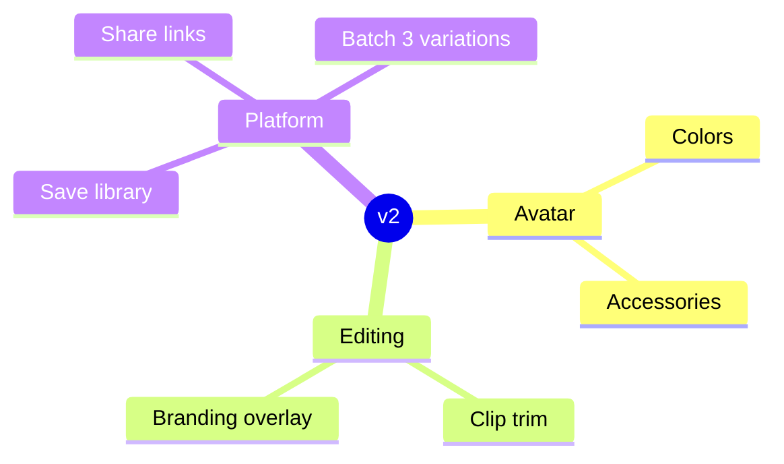

# System Architecture — AI Dance Generator

Architecture diagrams for the v1 product described in [prd.md](../prd.md). Use these in slides, README, or any Mermaid-capable viewer (GitHub, Notion, Obsidian, etc.).

---

## 1. High-level context

Who talks to what, and where compute runs.

---

## 2. End-to-end data flow

From upload to TikTok-ready export.

---

## 3. Frontend component map

Next.js App Router layout from the PRD.

---

## 4. Choreography pipeline (AI + audio signals)

How analyzed audio shapes what Claude generates.

---

## 5. Rendering & export (in-browser)

All preview and export stay on the client; no server-side video encoding in v1.

---

## 6. Deployment topology (v1 → production)

---

## 7. v2 scope (reference only)

Out of MVP but shown for roadmap context on slides.

---

## Legend

| Layer | Technology | Responsibility |
|-------|------------|----------------|
| UI | Next.js App Router | Upload, style, preview, regenerate, export trigger |
| Audio | FastAPI + librosa | Feature extraction (`POST /analyze`) |
| AI | Claude `claude-sonnet-4-6` | 8-count phrase keyframes (JSON) |
| Render | Canvas 2D | Stick figure playback synced to beats |
| Export | MediaRecorder + ffmpeg.wasm | Vertical MP4 for TikTok |

**Explicitly out of v1:** 3D avatars, motion capture, reference videos, native mobile, social platform posting APIs.
